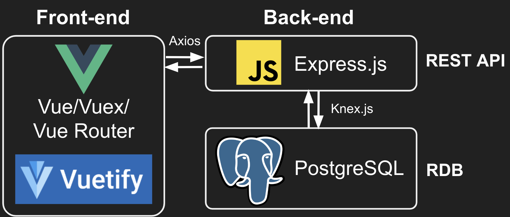
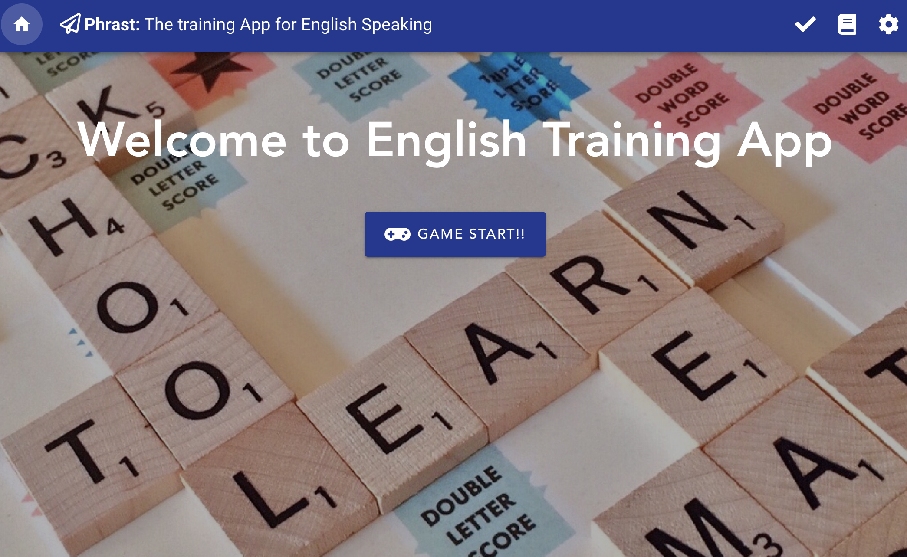
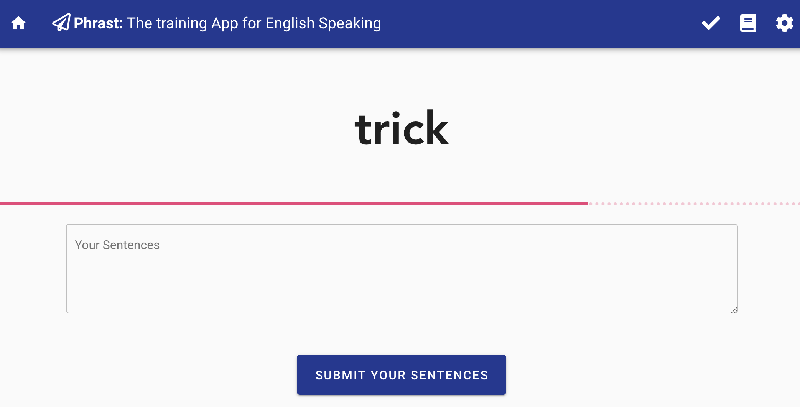

# Phrast: The training app of English Speaking

**This was created during my time as a student at [Code Chrysalis](https://www.codechrysalis.io/).**

Phrast is the training app of English Speaking for non-native speaker.

## Architecture



## Setup environment

### 1. PostgreSQL Database

You will need postgres installed. If you haven't installed it already, download and install the [PostgresApp](https://postgresapp.com/) and verify its working by running the command `psql` in your terminal.

Create a database for this project by running:

```bash
echo "CREATE DATABASE engl | psql
```

#### Database migration & Data importing

```bash
yarn run rollback:all
```

### 2. Starting REST API server

```bash
yarn dev
```

### 3. Starting Front-end server

```bash
yarn start
```

### Where are English words from?

#### 1. Basic Mode: The Longman Defining Vocabulary

This is the set of words which the Longman English Dictionary uses to express all its definitions.

[The Longman Defining Vocabulary](http://www2.cmp.uea.ac.uk/~jrk/conlang.dir/LongmanVocab.html)

#### 2. Hell Mode: WordsAPI

An API for the English Language. WordsAPI includes the definitions for more than 150,000 words. WordsAPI is provided via [Rakuten RapidAPI](https://rapidapi.com/).

[WordsAPI](https://www.wordsapi.com/)

## Project Status

View our responsive webapp @ [[spotak.herokuapp.com](https://english-speak-training.herokuapp.com/)](https://english-speak-training.herokuapp.com/). This project is currently in development.

**Current Features:**

- Randomly show an English word and create sentences using this word.
- Repeat the above process 3-10 times and finished.
- There is a time limit (ex. 60sec) until users finish to create sentences.
- There is two kind of level: Basic Mode uses about 2000 words from The Longman Defining Vocabulary. Hell Mode uses about more then 150,000 words from WordsAPI.
- Users can review what kind of sentences users create before.

**Future Features:**

- Migrate into AWS

## Screen Shot





## license

Copyright (c) 2019- Naoto Imamachi licensed under the MIT license.
